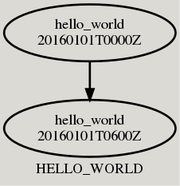
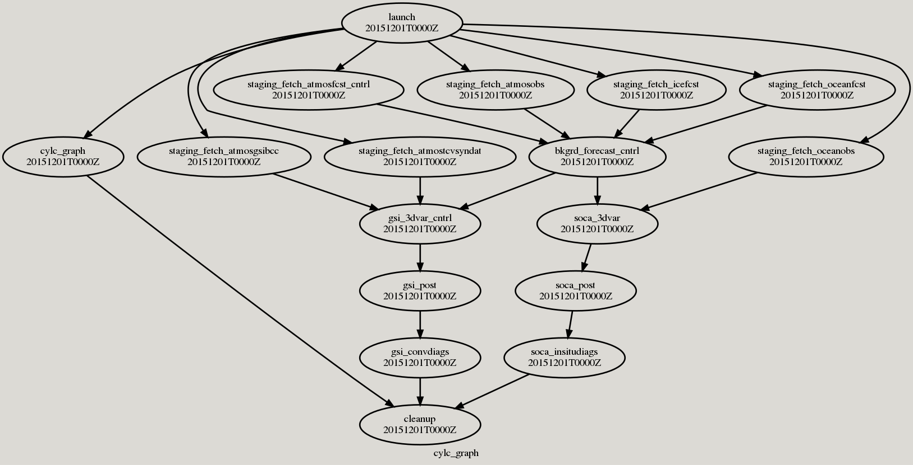
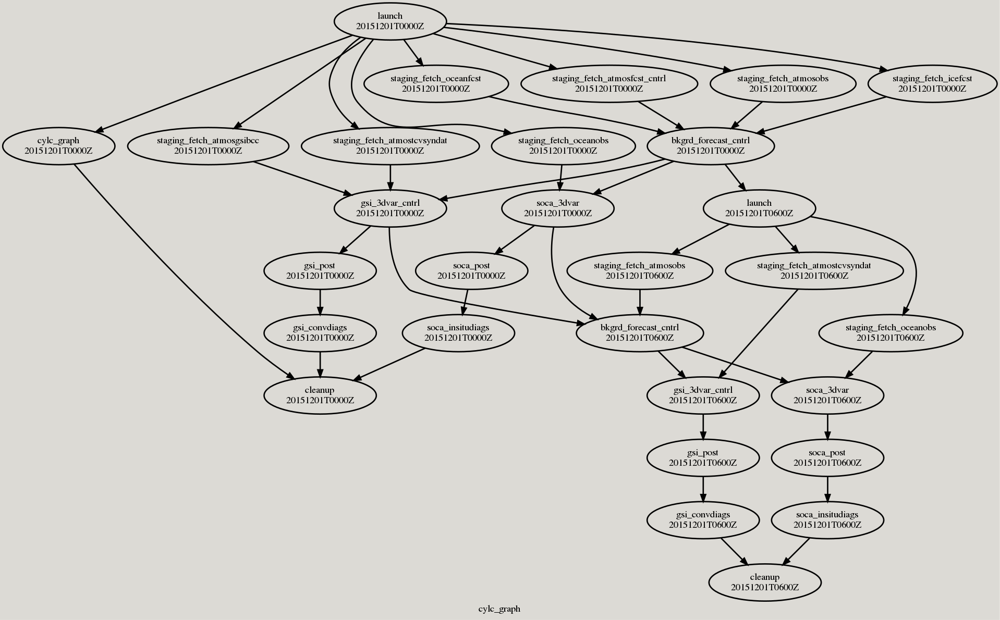
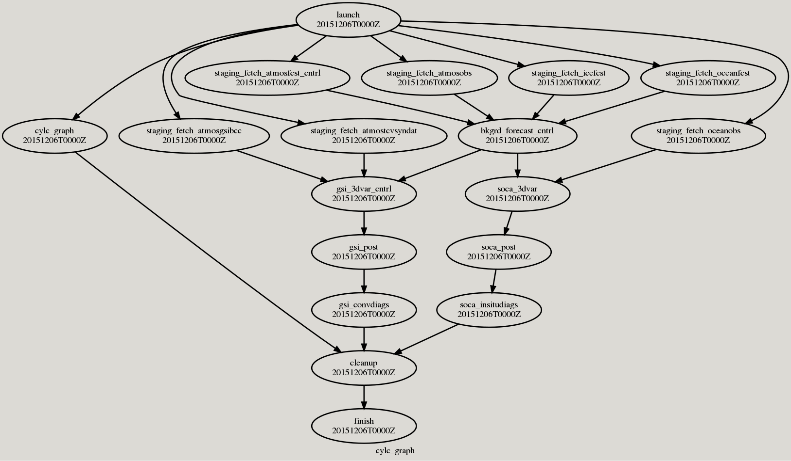

# Cylc Engine Workflow Application Evaluation Tools

A Singularity container is provided for all of the tools described
below and instructions are provided for the respective tools. The
Singularity container may be collected as follows.

~~~
user@host:$ singularity pull --arch amd64 library://noaaufsrnr/noaaufsrnr/ubuntu18.04-miniconda_ufs_pyutils.cylc_tools:latest CYLC_TOOLS.sif
~~~

### Cylc Engine Workflow Application Graph

The `cylc_graph.py` application allows a user to create an image of
the Cylc engine application workflow suite. The application may be
executed as follows.

~~~
user@host:$ python cylc_graph.py --<suite_path> --<output_path>
~~~

In the above example, the `<suite_path>` is the path below which the
Cylc engine application workflow suite exists.. This is typically
found beneath `/path/to/experiment/cylc/<experiment_name>/`. The
`<output_path>` argument is the path to where the Cylc engine
application workflow suite images will be created. The following are
images generated from the `HELLO_WORLD` example.

| Cold-start Cycles | Warm-start Cycles | Final Cycle | 
| :-------------: | :-------------: | :-------------: |
|  |  |  |

More complicated Cylc engine application workflow suite images, from a
Cylc engine application experiment workflow is as follows.

| Cold-start Cycles | Warm-start Cycles | Final Cycle | 
| :-------------: | :-------------: | :-------------: |
|  |  |  |

The `cylc_graph.py` application can also be run within the Singularity
container noted above as follows.

~~~
user@host:$ singularity exec CYLC_TOOLS.sif --bind /path/to/cylc/<experiment_name/:/run --bind /path/to/ufs_engines/cylc/tools/:/tools --bind  /path/to/ufs_engines/cylc/output/:/output /miniconda/bin/python /tools/cylc_graph.py --suite_path=/run --output_path=/output
~~~

### Cylc Engine Workflow Application Status

The `cylc_status.py` application allows a user to parse a Cylc engine
workflow application SQLite3 database file and return both a status
table as well as diagnostic statistics for the respective workflow
application tasks.

To execute the application do as follows.

~~~
user@host:$ python cylc_status.py --<database_path> --<output_path> --<to_output>
~~~

In the above example `<database_path>` is the full-path to the Cylc
engine worklow application SQLite3 database file. This file is
typically found beneath
`/path/to/experiment/cylc/<experiment_name>/cylc-suite.db` or
`/path/to/experiment/cylc/<experiment_name>/log/db`. The
`<output_path>` argument is the path to which the status and
diagnostic statistics tables will be written if the `<to_output>`
argument is `True`.

Examples of the status and diagnostic statistics are the respectively
following.

~~~
╒════════════════╤═══════════════════════════╤═══════════╤══════════════════════════════╤══════════════════════════════╤════════════════╤════════════╕
│     Cycle      │           Task            │  Status   │          Start Time          │          Stop Time           │  Run Time (s)  │  Attempts  │
╞════════════════╪═══════════════════════════╪═══════════╪══════════════════════════════╪══════════════════════════════╪════════════════╪════════════╡
│ 20151201T0000Z │      ufs_apps_launch      │ SUCCEEDED │ 00:16:31 UTC 13 January 2023 │ 00:16:33 UTC 13 January 2023 │       2        │     1      │
├────────────────┼───────────────────────────┼───────────┼──────────────────────────────┼──────────────────────────────┼────────────────┼────────────┤
│ 20151201T0000Z │          launch           │ SUCCEEDED │ 00:16:31 UTC 13 January 2023 │ 00:16:34 UTC 13 January 2023 │       3        │     1      │
├────────────────┼───────────────────────────┼───────────┼──────────────────────────────┼──────────────────────────────┼────────────────┼────────────┤
│ 20151201T0000Z │ ufs_apps_fetch_seviri_obs │ SUCCEEDED │ 00:16:40 UTC 13 January 2023 │ 00:16:43 UTC 13 January 2023 │       3        │     1      │
├────────────────┼───────────────────────────┼───────────┼──────────────────────────────┼──────────────────────────────┼────────────────┼────────────┤
│ 20151201T0000Z │  ufs_apps_fetch_iasi_obs  │ SUCCEEDED │ 00:16:40 UTC 13 January 2023 │ 00:18:45 UTC 13 January 2023 │      125       │     1      │
├────────────────┼───────────────────────────┼───────────┼──────────────────────────────┼──────────────────────────────┼────────────────┼────────────┤
│ 20151201T0000Z │  ufs_apps_fetch_hirs_obs  │ SUCCEEDED │ 00:16:40 UTC 13 January 2023 │ 00:19:46 UTC 13 January 2023 │      186       │     1      │
├────────────────┼───────────────────────────┼───────────┼──────────────────────────────┼──────────────────────────────┼────────────────┼────────────┤
│ 20151201T0000Z │  ufs_apps_fetch_amv_obs   │ SUCCEEDED │ 00:16:37 UTC 13 January 2023 │ 00:16:39 UTC 13 January 2023 │       2        │     1      │
├────────────────┼───────────────────────────┼───────────┼──────────────────────────────┼──────────────────────────────┼────────────────┼────────────┤
│ 20151201T0000Z │  ufs_apps_fetch_airs_obs  │ SUCCEEDED │ 00:16:37 UTC 13 January 2023 │ 00:17:40 UTC 13 January 2023 │       63       │     1      │
├────────────────┼───────────────────────────┼───────────┼──────────────────────────────┼──────────────────────────────┼────────────────┼────────────┤
│ 20151201T0000Z │ ufs_apps_fetch_gprso_obs  │ SUCCEEDED │ 00:16:40 UTC 13 January 2023 │ 00:16:43 UTC 13 January 2023 │       3        │     1      │
├────────────────┼───────────────────────────┼───────────┼──────────────────────────────┼──────────────────────────────┼────────────────┼────────────┤
│ 20151201T0000Z │  ufs_apps_fetch_atms_obs  │ SUCCEEDED │ 00:16:37 UTC 13 January 2023 │ 00:19:43 UTC 13 January 2023 │      186       │     1      │
├────────────────┼───────────────────────────┼───────────┼──────────────────────────────┼──────────────────────────────┼────────────────┼────────────┤
│ 20151201T0000Z │  ufs_apps_fetch_mhs_obs   │ SUCCEEDED │ 00:16:40 UTC 13 January 2023 │ 00:17:47 UTC 13 January 2023 │       67       │     1      │
├────────────────┼───────────────────────────┼───────────┼──────────────────────────────┼──────────────────────────────┼────────────────┼────────────┤
│ 20151201T0000Z │ ufs_apps_fetch_saphir_obs │ SUCCEEDED │ 00:16:40 UTC 13 January 2023 │ 00:16:41 UTC 13 January 2023 │       1        │     1      │
├────────────────┼───────────────────────────┼───────────┼──────────────────────────────┼──────────────────────────────┼────────────────┼────────────┤
│ 20151201T0000Z │  ufs_apps_fetch_msu_obs   │ SUCCEEDED │ 00:16:40 UTC 13 January 2023 │ 00:16:42 UTC 13 January 2023 │       2        │     1      │
├────────────────┼───────────────────────────┼───────────┼──────────────────────────────┼──────────────────────────────┼────────────────┼────────────┤
│ 20151201T0000Z │  ufs_apps_fetch_ssu_obs   │ SUCCEEDED │ 00:16:40 UTC 13 January 2023 │ 00:17:42 UTC 13 January 2023 │       62       │     1      │
├────────────────┼───────────────────────────┼───────────┼──────────────────────────────┼──────────────────────────────┼────────────────┼────────────┤
│ 20151201T0000Z │  ufs_apps_fetch_amsu_obs  │ SUCCEEDED │ 00:16:37 UTC 13 January 2023 │ 00:19:40 UTC 13 January 2023 │      183       │     1      │
├────────────────┼───────────────────────────┼───────────┼──────────────────────────────┼──────────────────────────────┼────────────────┼────────────┤
│ 20151201T0000Z │  ufs_apps_fetch_goes_obs  │ SUCCEEDED │ 00:16:37 UTC 13 January 2023 │ 00:16:40 UTC 13 January 2023 │       3        │     1      │
├────────────────┼───────────────────────────┼───────────┼──────────────────────────────┼──────────────────────────────┼────────────────┼────────────┤
│ 20151201T0000Z │  ufs_apps_fetch_ssmi_obs  │ SUCCEEDED │ 00:16:40 UTC 13 January 2023 │ 00:16:42 UTC 13 January 2023 │       2        │     1      │
├────────────────┼───────────────────────────┼───────────┼──────────────────────────────┼──────────────────────────────┼────────────────┼────────────┤
│ 20151201T0000Z │  ufs_apps_fetch_cris_obs  │ SUCCEEDED │ 00:16:37 UTC 13 January 2023 │ 00:17:50 UTC 13 January 2023 │       73       │     1      │
├────────────────┼───────────────────────────┼───────────┼──────────────────────────────┼──────────────────────────────┼────────────────┼────────────┤
│ 20151201T0000Z │ ufs_apps_fetch_ssmis_obs  │ SUCCEEDED │ 00:16:40 UTC 13 January 2023 │ 00:16:42 UTC 13 January 2023 │       2        │     1      │
╘════════════════╧═══════════════════════════╧═══════════╧══════════════════════════════╧══════════════════════════════╧════════════════╧════════════╛

Last Updated: 16:44:54 UTC 13 January 2023
~~~

~~~
╒═══════════════════════════╤═════════════════════╤═══════════════════════╤════════════════════════════╤══════════════════════════════╕
│           Task            │  Mean Run Time (s)  │  Median Run Time (s)  │  Run Time Variability (s)  │  Total Number of Executions  │
╞═══════════════════════════╪═════════════════════╪═══════════════════════╪════════════════════════════╪══════════════════════════════╡
│          launch           │                     │                       │                            │              1               │
├───────────────────────────┼─────────────────────┼───────────────────────┼────────────────────────────┼──────────────────────────────┤
│  ufs_apps_fetch_airs_obs  │       104.333       │          64           │          57.7485           │              3               │
├───────────────────────────┼─────────────────────┼───────────────────────┼────────────────────────────┼──────────────────────────────┤
│  ufs_apps_fetch_amsu_obs  │         124         │          124          │          48.1733           │              3               │
├───────────────────────────┼─────────────────────┼───────────────────────┼────────────────────────────┼──────────────────────────────┤
│  ufs_apps_fetch_amv_obs   │       1.66667       │           2           │          0.471405          │              3               │
├───────────────────────────┼─────────────────────┼───────────────────────┼────────────────────────────┼──────────────────────────────┤
│  ufs_apps_fetch_atms_obs  │       84.6667       │          63           │          75.4645           │              3               │
├───────────────────────────┼─────────────────────┼───────────────────────┼────────────────────────────┼──────────────────────────────┤
│  ufs_apps_fetch_cris_obs  │         87          │          73           │          26.4197           │              3               │
├───────────────────────────┼─────────────────────┼───────────────────────┼────────────────────────────┼──────────────────────────────┤
│  ufs_apps_fetch_goes_obs  │          2          │           2           │          0.816497          │              3               │
├───────────────────────────┼─────────────────────┼───────────────────────┼────────────────────────────┼──────────────────────────────┤
│ ufs_apps_fetch_gprso_obs  │       2.33333       │           2           │          0.471405          │              3               │
├───────────────────────────┼─────────────────────┼───────────────────────┼────────────────────────────┼──────────────────────────────┤
│  ufs_apps_fetch_hirs_obs  │       125.667       │          185          │          84.6181           │              3               │
├───────────────────────────┼─────────────────────┼───────────────────────┼────────────────────────────┼──────────────────────────────┤
│  ufs_apps_fetch_iasi_obs  │       87.3333       │          125          │          53.2687           │              3               │
├───────────────────────────┼─────────────────────┼───────────────────────┼────────────────────────────┼──────────────────────────────┤
│  ufs_apps_fetch_mhs_obs   │         65          │          67           │          48.1941           │              3               │
├───────────────────────────┼─────────────────────┼───────────────────────┼────────────────────────────┼──────────────────────────────┤
│  ufs_apps_fetch_msu_obs   │          2          │           2           │             0              │              3               │
├───────────────────────────┼─────────────────────┼───────────────────────┼────────────────────────────┼──────────────────────────────┤
│ ufs_apps_fetch_saphir_obs │       1.66667       │           2           │          0.471405          │              3               │
├───────────────────────────┼─────────────────────┼───────────────────────┼────────────────────────────┼──────────────────────────────┤
│ ufs_apps_fetch_seviri_obs │       3.33333       │           3           │          0.471405          │              3               │
├───────────────────────────┼─────────────────────┼───────────────────────┼────────────────────────────┼──────────────────────────────┤
│  ufs_apps_fetch_ssmi_obs  │       1.66667       │           2           │          0.471405          │              3               │
├───────────────────────────┼─────────────────────┼───────────────────────┼────────────────────────────┼──────────────────────────────┤
│ ufs_apps_fetch_ssmis_obs  │          2          │           2           │             0              │              3               │
├───────────────────────────┼─────────────────────┼───────────────────────┼────────────────────────────┼──────────────────────────────┤
│  ufs_apps_fetch_ssu_obs   │         22          │           2           │          28.2843           │              3               │
├───────────────────────────┼─────────────────────┼───────────────────────┼────────────────────────────┼──────────────────────────────┤
│      ufs_apps_launch      │       1.66667       │           2           │          0.471405          │              3               │
╘═══════════════════════════╧═════════════════════╧═══════════════════════╧════════════════════════════╧══════════════════════════════╛

CAUTION: Run-time statistics may not be accurate representations of certain tasks depending upon the user experiment configuration.

Last Updated: 16:44:54 UTC 13 January 2023
~~~

The `cylc_status.py` application can also be run within the Singularity
container noted above as follows.

~~~
user@host:$ singularity exec CYLC_TOOLS.sif --bind /path/to/cylc/<experiment_name/:/run --bind /path/to/ufs_engines/cylc/tools/:/tools --bind  /path/to/ufs_engines/cylc/output/:/output /miniconda/bin/python /tools/cylc_status.py --database_path=/run/log/db --output_path=/output
~~~

#

Please direct questions to [Henry
R. Winterbottom](mailto:henry.winterbottom@noaa.gov?subject=[UFS-Engines)